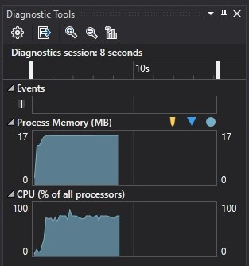
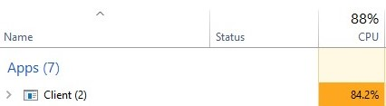
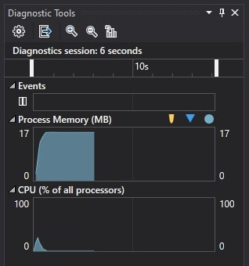
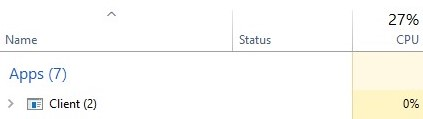

# CLUNKS

***C**ommand* ***L**ine* ***U**nification* ***N***etwor***k*** ***S**ystem*

**CLUNKS** is a system to provide simple LAN video conferencing for large businesses and establishments. Users only need to create a **CLUNK** server on their network, and they will be able to host and join video calls with anyone on that network.

---

## Servers
When the user first installs the product, they will need to create a *CLUNK server* to be able to do anything. The CLUNK server is the server-side program which manages all sub-servers and serves clients.

To create a CLUNK server, the user must be an admin/superuser on their system. Using ClunksExp, they can create exp files to configure the server. The server program itself is a windowless Windows Application. It only needs to be started on the server machine, from there it can be interacted with though the client scripts.

A CLUNK server hosts *sub-servers*. Sub-servers are designed to create physical separation withing the server, each sub-server be represented as a seperate entity in the database. Because of this design, a user registered to a sub-server, will not exist in any other sub-server unless they are created in the other sub-servers also. This allows the admin of the CLUNK server to create separation within the server. For example, a school may use CLUNKS for meetings, but create seperate subservers for each year group.

The server admin can also create *global users*. These are users who are not tied to one specific sub-sever but exist globally to the entire server. In the school scenario, this would be used to create accounts for teachers, since it allows the admin to create the user once, rather than making a new one for each year group sub-sever.

The ability to run commands within CLUNKS is controlled by the server admin. The server-admin can grant different permissions to different users which will allow them to do certain things. In the school example, the server admin may configure the server such that only teachers can start calls, and sudents may only join existing ones. To achive this, the would create an *elevation level* (one for the student and one for the teacher). Elevation levels describe the actions that a user is allowed to make. The teacher elevation level would have the ability to make calls, the student one would not. These elevation levels can then be assigned to the users as the admin sees fit.

---

## Using **CLUNKS**
As the name suggests, **CLUNKS**, is a command line application, the recommded usage is to add **CLUNKS** to the user's environment variables so they can call the program from their command prompt/terminal.

To run the program, users will call ```clunks [serverIP]```, (or whatever the program is named in the user's environment variables). They can tell they're in the **CLUNKS** environment as their command promt/terminal will change to:
```
CLNKS>>>
```
***CLUNKS** commands are not case sensitive*

### **Logging in**
A user can enter a sub-server with:
```
CLNKS>>> connect [subservername] [username]
```
If a user with the provided username exists on on the sub-server, the sub-server will reply with:
```
[subservername]
CLNKS>>> Enter your password:
```

After the initial login, one of the first things a user might want to do is change their password from whatever was assinged to them by the admin, they can do this with:
```
[subservername]
CLNKS>>> changepwd [old password] [new password]
```

### **Calling**
After a user has entered the sub-server, they can create calls. To call another user, they can run:
```
[subservername]
CLNKS>>> call [username]
```
This will send a call to the desired user, which can be accepted or rejected by them. Call requests look like:
```
[subservername]
CLNKS>>> [username] is calling. Accept?
```
The user can enter ```y``` to accept or ```n``` to decline. After two seconds with no response, the request is repeated again. Requests are repeated 10 times until they are automatically quit. The orignal user would be informed that the call was not picked up. The intended receiver would have notification added to their notificatioons if they missed the call

For large conference calls, the user can also create a call on the server with the ```call``` command This creates a conference call that anyone on the subserver can join into by running ```joincall```.

### **Messaging**
Messaging is another base feature of sub-servers. Users can message each other with:
```
[subservername]
CLNKS>>> message [username] [message]
```

This will send a message to the user. Messages are stored in the database. To see message history a user can run:
```
[subservername]
CLNKS>>> chat [username] [message]
```

This will display the message history along with a line at the bottom where users can send messages, creating a chat-room like experience. The user can configure how far back the message history should show in their settings.

### **Rooms**
For group calls, the user can call the sub-server, and any member of the sub-server is able to join that call, however if a user wanted to make a group call that didn't include all members of the sub-server, they can create a room.

Rooms are logical partitions of a sub-server. Unlike sub-servers, they do not have their own database (hence logical), but are entities within the sub-server's database. This allows for partial separation within sub-servers for organisational purposes.

Unlike sub-servers, rooms can be created from the client-side. This can be done with:
```
[subservername]
CLNKS>>> makeroom [roomname] [password]
```
*Where [password] is optional*

To join a room, the user would run:
```
[subservername]
CLNKS>>> joinroom [roomname] [password]
```
Rooms have the same behaviour as sub-servers, but rooms can be infinitely created within each other. When in a room, a user can only call other members of the room.

### **Groups**
Groups are similar to rooms, except they are temporary. They serve the purpose of allowing the user to make privatised group calls without needing to impact the structure of the sub-server.

A user can create a group with ```makegroup``` or join a group with ```joingroup```.

The group will exist until all its members quit the program. If they leave the group but still have the program open, the group will be kept alive until the last group member quits the program (in case anyone wants to rejoin).

### **Call actions**

When in large group calls, the screen may become crowded by camera feeds of all the other users. To manage this, the user can user use ```hide [username]``` and ```show [username]``` to toggle which user's are shown. When a user is hidden, you can only hear them, but not see. A user in a call can be completely ignored with ```mute [username]```. ```mute``` can be undone with ```unmute```. Passing ```self``` into the ```[username]``` argument will perfrom the action on the user.

### **User commands**
There are commands that users can run to obtain information about the subserver. 

*Contacts:* ```contacts``` will show all the contacts of whatever space the user is in. If the user runs ```contacts``` from a sub-server, they will see a list of all the sub-server's members, but running ```contacts``` from a room will show the contact list of the current room.

*Self:* ```self``` will show the information of the user who calls it, it can show things like: granted permissions, joined rooms, number of calls, etc. Running ```self``` during a call will show wether the user is muted and camera is showing.

*Structure:* ```stucture``` will show the structure of the current sub-server, in a tree-type view. This includes any rooms and groups that haven't been marked as hidden.

*Notifications:* ```notifications``` will show the any notifications the user has from the server, such as missed calls. The user can clear their notifications, otherwise all uncleared notifications will be loaded when the command is run. (Add limit per user to prevent inifite database expansion?)

*Stats:* ```stats``` will show logged statistics to the user. This can include information such as processed packets per second; how many UDP datagrams are too large for the buffer size as a percentage, etc. The user can use these statistics to make informed decisions on which settings to set in ```settings```

*Settings:* ```settings``` will allow the user to configure the program to run differently to optimise efficiency and improve the user experience for them personally.

----
# Technical Notes
## Program Protocols - Packets
Even though CLUNKS uses TCP/UDP for network transmission, alone, they only offer the ability to send bytes over the network, making it diffuclt for the receiving device to interpret what these bytes represent. To sovle this a wrapper protocol was needed to govern how these bytes are arranged. This protocol can be seen in the Common.Packets.Packet class, which provides a wrapper for the Common.Channel classes to use when transferring data.

When data is being sent from one party to another, a `Packet` is created to hold the data. Packets contain some meta-data:
 - **Salts** - used for certificates.
 - **UserID** - used to identify the user who created that packet (or the recipient user if the packet was created by the server).
 - **DataID** - used to identiy what type of information is held in the packet.

DataIDs are implemented as a C# enum. They are used by the Channel classes to identfy how to treat different packets.

UserIDs are unsigned integers used to identify different ClientChannels/ClientModels. They are unsigned because negative numbers can cause awkward encoding issues when serializing the packet. UserID's are counted from 1 upwards, where 1 is the null value for an unnasigned user. 1 is used as the null value because negative numbers can't be used and 0 is always a difficult value to process since when the packet is serialized into an array of bytes, it is impossible for the receiver to distinguish between a 0 meaning the number 0 and a 0 meaning an empty byte, which means that packets can't be reconstructed.

The 'body' of the packet is a JSON object which hold the actual data to send. When packets are being sent, the packet metadata and body are added to a new JSON object called the `payload`. A payload may look something like this:

```json
{
    "dataID": "Signature",
    "userID": 9,
    "salt": "]DAV,22K3[wDhLz",
    "body" : {
        "signautre": "&%%^rNsEZC3}1aX(gn2,:z"
    }
}
```
*NOTE: in reality, the salt and signautre are byte arrays encoded into Base64, so wouldn't contain some of the characters shown in the above example.*

When a packet is being serialized into a byte array (so that it can be sent over the network), a the payload is constructed, then symmetrically encrypted. The symmetric key and IV then get asymmetrically with the receiver's public key. From here, the encrypted payload and encrypted symmetric data are added to a new array, preceeded by the total length of the payload. This length is used by the recipient to extract the payload bytes from the total byte array (the length of the encrypted data is a stored constant so doesn't need to be sent). The total legnth is always a 32 byte integer, so takes up the first 4 bytes of the serialization output. This new array can then be sent off across the network and the packet can be reconstruced by reversing the serialization process.

## Concurrecny
Both the client and server channels use five 'master threads' to asynchronously perform operations. These five threads perform the network operations and can spawn other threads when needed to assist with their task.

One of these threads is the listening thread, used for listening for incoming data on the socket. The client only communicates with one server at a time, so the listening is quite simple but the server needs the ability to listen to multiple clients simultaneously. An adapted version of the Apache philosophy was implemented to achieve this.

Apache servers create a new thread to serve each incoming user's requests. Of course, this means that the limit to how many users can be served at once will be whatever the maximum thread count assigned to the program but on powerful machines with lots of system resouces, this doesnt tend to be an issue. However, **CLUNKS** is designed to be friendly to all types of machine and on slower or systems, these limitations could ruin the user experience.

To combat this, the **CLUNKS** server creates a new threads to only when needed to perform tasks, rather than to serve users. This means that instead of creating a new thread whenever a new user joins, a new thread is created only if there are no idle threads available. For example, if there was only one listening thread currently being used, and a new user is attempting to send data, if the current thread is idle, that thread is assigned to process the new data. This minimises the amount of threads being used by the program at any given time and also thwarts the Slow Lloris DOS attacks that Apache servers are so vulnerable to.

### **Networking**
The program performs all network operations on seperate threads to ensure that the user isnt left waiting for network repsonses while using the program on the client side, and to allow the server the flexibilty of serving multiple users at once.

From a programming perspective, this achieved using asynchronous callbacks. This means that in the channel scripts (the classes created for network communications), a call is made to the socket to begin listening for activity on the bound endpoint (where the endpoint is the IP/port identity of the remote party) and delegate of the callback method is also passed in. The supplied callback is invoked when activity is detected, this allows the executing thread to be free to perform other activities whilst the callback is waiting to be invoked.

The concurrent networking design is further extended when listening for TCP packets. When listening for UDP, the process is relatively simple since data is sent in datagrams (packaged and sent all at once), so only one callback is needed to capture and process the datagram. However, TCP is a stream based protocol, this means that after a connection is established data is broken down and sent in pieces, contrary to the 'all at once' approach of UDP.

This introduces some complexity for processing data sent in TCP, since a single callback may not capture the entire data Packet. To solve this, a recursive design, paired with a chunk-segmented buffer was implemented to make sure that TCP packets are handled correctly. Here is a snippet containing the TCP reception algorithm implemented in the server (the client utilises the same algorith, but uses some different variables to do so).

First, the server begins listening for incoming data on the network pipe:

``` c#  
client.Handler.BeginReceive(client.New(), 0, HEADER_SIZE, SocketFlags.None, new AsyncCallback((IAsyncResult ar) => 
{
    client.receivingHeader = true;
    ReceiveTCPCallback(ar, 0);
}), client);
```

Here, `client.Handler` is the socket being used to receive data from the client. `BeginReceive()` is the method which begins listening to incoming data. Into this method, we pass:
- `buffer`: The array to read data into, created by `client.New()`, which creates and returns a new chunk of the client's buffer.
- `offset`: The zero-based index to write data from (`0`) when writing data into the buffer.
- `length`: The maximum amount of data to receive, in this case `HEADER_SIZE` equals 4 because a 4 byte header is always sent before the rest of the data to inform the recipient how much data they should expect to receive in total.
- `socketFlags`: The `SocketFlags` to use (extra socket confiuration), in this case it is set to `SocketFlags.None`, which is the `SocketFlags` class' equivalient to `null`
- `callback`: The asynchronous callback to invoke when data is received
- `state`: An object which can be casted out of the `IAsyncResult.AsyncState` object that gets passed into the asynchronous callback. Since the algorithm is recursive, the `client` object gets passed as the the state object parameter so it can be used in later recursions. This has the same effect as passing the object directly into the method as an argument

The asynchronous callback first sets the boolean value `receivingHeader` to `true`. `receivingHeader` is a feild on the `ClientModel` class (the class that `client` is a member of) which represents if a client is currently reading the 4 byte header or the actual datastream. It then calls into `ReceiveTCPCallback()`, the method that handles the procesing of the datastream for TCP listening. Here is a simplified sample of it (*exception handling removed*):

``` c#
private protected override void ReceiveTCPCallback(IAsyncResult ar, int bytesToRead)
{
    ClientModel client = (ClientModel)ar.AsyncState;
    int bytesRead = client.Handler.EndReceive(ar);
    if (client.receivingHeader)
    {
        bytesToRead = BitConverter.ToInt32(client.Get());
        bytesRead = 0;
        client.receivingHeader = false;
    }
    if (bytesToRead - bytesRead > 0)
        client.Handler.BeginReceive(client.New(), 0, client.bufferSize, SocketFlags.None, new AsyncCallback((IAsyncResult ar) => {
            ReceiveTCPCallback(ar, bytesToRead - bytesRead);
        }), client);
    else
    {
        Process(client.Get());
        client.receiving = false;
    }
}
```

The parameters of `ReceiveTCPCallback()` are an `IAsyncResult` which stores information about the asynchronous callback, and an `int` (`bytesToRead`) which represnets the number of bytes left unread in the datastream. First, the client is casted out of the `AsyncState` of the `IAsyncResult`. The number of bytes read from the receive is then stored into `bytesRead`. If the client is currently reading the header, `bytesToRead` is overwritten with the value stored in the 4 byte header that was just received. If the client is not currently receiving the header, the algorithm will check to see if the original number of unread bytes (before the receive) is equal to the number of bytes that it just received, if so then all the data has been read and the data stored in the buffer can be processed . Otherwise, it begins receiving again with an new chunk of the buffer to write into, and calls itself in the asynchronous callback with `bytesToRead` set to the recalculated value of the new number of undread bytes in the datastream.

On first glance this algorithm may seem to work fine, but there is a flaw in the design with how `BeginRecieve()` is used. When the method was first being written, I had thought that `BeginRecieve()` would only invoke its asynchronous callback when it had read all bytes passed into `length`, when actually `length` only specifies the *maximum* amount of bytes that can be received. This creates the issue that if the incoming data doesn't fill the chunk of the buffer that was created for it, then a new chunk is created and the rest of the data is stored in there, runinig the continuity of the datasream. On intial testing of the method this caused no issues, since the client and server were being tested locally on the same machine the data never actually left the machine, but later on when attempting to connect to the server on a different machine, the TCP listeners revealed the issue, behaving unpredicatbly and incosistently since the rate of data transfer over a network is much slower than the rate of data transfer within a single machine, so some packets didn't make it in time to get picked up by `BeginRecieve()` by the time the callback had been invoked.

After troubleshooting the issue and identifying that this was the problem, the original solution was to re-write the current algorithm to re-use old chunks of the buffer if data didn't fill the chunk:

``` c#
private protected override void ReceiveTCPCallback(IAsyncResult ar, int bytesToRead)
{
    ClientModel client = (ClientModel)ar.AsyncState;
    int bytesRead = client.Handler.EndReceive(ar);
    if (client.receivingHeader)
    {
        bytesToRead = BitConverter.ToInt32(client.Get());
        bytesRead = 0;
        client.receivingHeader = false;
        client.freeChunk = true;
    }
    if (client.attemptedToFill)
        client.freeChunk = client.chunkList[client.chunkList.Count - 1].Length == client.chunkSize;
    if (bytesToRead - bytesRead > 0)
    {
        if (bytesRead == client.chunkSize || client.freeChunk)
            client.Handler.BeginReceive(client.New(), 0, client.chunkSize, SocketFlags.None, new AsyncCallback((IAsyncResult ar) =>
            {
                client.freeChunk = false;
                ReceiveTCPCallback(ar, bytesToRead - bytesRead);
            }), client);
        else
            client.Handler.BeginReceive(client.chunkList[client.chunkList.Count - 1], client.chunkList[client.chunkList.Count - 1].Length, client.chunkSize - client.chunkList[client.chunkList.Count - 1].Length, SocketFlags.None, new AsyncCallback((IAsyncResult ar) =>
            {
                client.attemptedToFill = true;
                ReceiveTCPCallback(ar, bytesToRead - bytesRead);
            }), client);
    }
    else
    {
        Process(client.Get());
        client.receiving = false;
    }
}
```

However this also was scrapped since it added complexity into the logic of the algorithm and variable feilds of the `ClientModel` class, and still utilised a chunked buffer. In situations such as this, a chunked buffer is undesirable since the process of creating chunks has a large computional footprint so is quite expesive on the CPU. To solve these issue the algorithm was redesigned into this *(also simplified)*:

``` c#
private protected override void ReceiveTCPCallback(IAsyncResult ar, int offset = 0)
{
    ClientModel client = (ClientModel)ar.AsyncState;
    int bytesRead = client.Handler.EndReceive(ar);
    int maxToReceive;
    if (client.receivingHeader)
    {
        int bytesToRead = BitConverter.ToInt32(client.buffer);
        client.CreateBuffer(bytesToRead);
        maxToReceive = bytesToRead;
        client.receivingHeader = false;
    }
    else
    {
        offset += bytesRead;
        client.Update(bytesRead);
        maxToReceive = client.FreeBytes();
    }

    if (maxToReceive > 0)
        client.Handler.BeginReceive(client.buffer, offset, maxToReceive, SocketFlags.None, new AsyncCallback((IAsyncResult ar) =>
        {
            ReceiveTCPCallback(ar, offset);
        }), client);
    else
    {
        Process(client.Get());
        client.receiving = false;
    }
}
```

In this final version of the redesigned algorithm, the uses the header to determine how many bytes to expect (as usual), but then creates a buffer which is the size of the incoming data. This way the buffer only needs to be created once and doesn't need to be expanded, and it also allows the buffer to be implemented as an `Array` instead of a `List` (since the size is no longer variable) which much more efficient to use. This algorithm also attempts to always read as much of the incoming data in one go as is possible. This reduces the depth of recursion since less data is left behind per read. To do this, the algorithm utilises the `offset` parameter of the `BeginReceive()` method, to write continuous data into the next available space of the buffer, eliminating continuity the problems caused by the old chunked buffer algorithm.

The computational footprint of this algorithm is much smaller since the buffer is only created once and gets passed around when needed. All this was achived at the cost of the memory footprint, though since each time `client` gets recasted out of `ar.AsyncState` the complete buffer is copied into the new object, so if a single datastream reception recurses very deeply, then the buffer will be copied many many times which could be dangerous, especially if the buffer is large. Both algorithms would require the buffer to be copied into the new object, the only difference is that in the original algorithm the buffer gradually increased in size, so the first copy would be smaller than the next, resulting in a smaller total overall. This comparison of memory footprint expressed mathematically, using big O notation (*examples will use a chunk size of 1Kb and a recusion depth of 3*):

> ***Algorithm 1***: As metioned before, the first algorithm gradually increased the size of the user's buffer, so after all the data has been received, the client would have been copied 3 times with the first buffer having size *1Kb*, the second *2Kb* and the third *3Kb*. The total size therefore is: 
 .
> <!--- 1 + 2 + 3 = 6Kb ---> 
>
> This can be expressed in general form as:
>
> 
> <!--- \begin{displaymath}\sum_{r=1}^n r = \frac{n(n+1)}{2} = \frac{n^2 + n}{2}\end{displaymath} --->
>
> *(where  is recursion depth)*
> <!--- n --->
> 
> Showing that the memory footprint of the first algorithm is:  .
<!--- O(n^2) --->
<br>

> ***Algorithm 2***: Unlike the first algorithm, the second algorithm creates the buffer once, instead of adding to it over time, so after all the data has been received, the total size used to store the buffer in memory would be:  (in the worst case).
>
> This can be expressed in general form as:
>
> 
> <!--- a^n --->
>
> *(where  is the buffer size [Kb] and  is recursion depth)*
> <!--- a --->
> <!--- n --->
>
> Showing that the memory footprint of the second algorithm is: , an exponential complexity which grows much faster than the polynomial complexity of the first algorithm. 
<!--- O(a^n) --->

While the new algorithm is clearly significantly worse on memory as `n` grows large, it is saved by the fact that `n` is very rarely large so on average the reduction of stress put the CPU by not needing to create new chunks of the buffer is worth the trade-off in memory performance.


## Data Flow
Network commmunication mainly used TCP because of the intergrety it ensures, but during video calls, The program will use UDP instead. A broadcasting user will send: the frame of their video, the audio frame, which user they are and the total size of the data in a C# class object seriliazed into JSON which will be serialized again into a bytestream. The receiving user will display the frames using the Gstreamer multimedia library. The user identification will only be used when managing calls with more than 2 members, but will be present in all data objects as part of the protocol used by CLUNKS.

UDP is being used because it creates very small packets, (about 60% smaller than TCP). It is also much faster than TCP by nature because it doesn't contain the slow error checking methods that TCP uses, doesn't wait for acknowledgement from the receiver, is connectionless, so an active connection doesn't need to be managed, doesn't compensate for lost packets and also doesn't attempt to guarantee packet delivery. Although this means that the packets recieved by the user may not be an accurate representation of what was originally sent, the eventual consistency reliant nature of the protocol (the philosophy that even if a few audiovisual frames are dropped in the process, the overall data received should be good enough to provide a good user experience) combined with the speed of data transfer makes it ideal for audiovisual streaming over a network.

## Security (Server)
The CLUNK server will use SQLite for database managmemnt. The only senstive information stored in the databases on the CLUNK server are the passwords used for user, rooms and groups. They will all be hashed with bcrypt.

## Security (User)
The client and server will perform a handshake on connection to ensure confididentiality and setup the asymmetric key exchange.

The handshake starts with the user sending a 'Hello' message to the server. This message contains the strength of encrpytion being used by the client, the server responds with an 'Ack' (acknowledgement). The second stage of the handshake starts with an 'Info' message from the client containing the client's public key to use for encryption. The server responds to this with a 'Hello' message containing its public key. The third roudntrip begins with an 'Ack' message from the client. responded to with an 'Info' message from the server containing the userID that the server has chosen to assing the client. This is responded to with the clients digital signature.

The digital signatures are created with the combination of encryption and hashing. Prior to the signature exchange, all messages have a *salt* added to them. Salts are randomly generated values which are appended to the body of a data payload to use for digital signature creation. The idea behind this is that at the end of the handshake, both parties need some data to sign to use for the encryption, usually this would be a log of all messages sent betweent the client and server (since it would be common to both) but in this case since the stages of the handshake are always the same, the data used to create the certificate would aways be the same too. To solve this, the salts are captured and stored by both parties and used to create the certificated at the end of the handshake.

To create a certificate:
 - The creator first hashes the list of all the salts they have sent out to create the certificate
 - The hash is then signed (encrypted) with the creators PRIVATE key (very important to note that the private key is being used for encryption instead of the public one)
 - The signed certificate can then be sent off to and verified by the other party

To verify a certificate:
 - The verifier decrypts the certificate they have been sent using the sender's PUBLIC key
 - They then hash the list of all the salts they have received (using the same hash functions as the creator) to create their own version of the same certificate
 - The two certificates can then be compared and if they match then the signature is verfied

This process is done once from server to client, then from client to server to provide security, integrity and confidentiality on both ends. It provides: security via the encryption; integrity via the hash (because if the data was changed the hashes wouldn't match) and confidentially via the signing of the asymmetric keys (since the intended sender would be the only person who had the correct private key to be able to sign the original digest).

## CPU Performance
### Thread Sleeping (on continuous threads)
When the Common.Channels.ClientChannel class was first created, it would use Common.Helpers.ThreadHelper.GetECThread to create and run threads that would run tasks endlessly. The idea of this was that data could be sent to the user at any time, so the socket would need to be constantly checked for new incoming data. During development, it was observed that the program was using a significant amount of processing power:




After some debugging the problem was identified to be caused by the ClientChannels threads constantly iterating millions of times per second. To solve this issue, the threads were paused for 10 milliseconds (per iteration) with ```Thread.Sleep(10)```. This decreased the rate at which these threads were running by pasuing the execution, and also allowint the OS's Task Scheduler to perform other work during this time. The reason the threads were using so much CPU prior to the change was because the Task Scheduler had no opportunity to switch between executing different threads, so they all had to be run at full power to make sure they're job would be done. Now, with the threads now resting for 10 milliseconds each, the Task Scheduler can be more efficient with its resource allocation. These are the results of the change:




*NOTE: the program will be using more than 0% CPU but the value is so low that it is displayed as 0% in Windows Task Manager*

Even though 10 milliseconds seems to be such a minor change to be creating such a significant result, it is important to note that 10 milliseconds in moder CPU time is a very large span of time in which much can happen.

It also may have come to mind that if the threads are waiting for 10 milliseconds per iteration, they could potentially miss any information that is sent to the socket while the thread is asleep. Fortunately, for C# this is not the case. The C# socket class is based off of the Berkley Socket Interface (originally implemented in C++) in which sockets communicate over a FIFO pipe created on the network. Any incoming data missed by the thread will be buffered by the pipe and can be collected when the thread resumes execution. Since the fastest that a thread will (most likely) ever need to run is around 30 iterations per second (since video calls often render frames at 30fps), the threads will have more than enough time to be able to sleep for 10ms and collect any missed data from the network pipe without introducting noticable latency in video calls, whilst still minimising CPU usage.

### EncryptionConfig
The EncryptionConfig class from Common.Helpers allows different users to use different levels of encryption instead of forcing all users to use the same.

This functionality was added because cryptographic functions (encryption, decryption and hashing) can be very slow on less powerful machines, which is undesirable in a real-time conferecing scenario, where latency is critical. Because of this, the server would have to choose between using stronger encryption that would increase security but worsen they user experience for users with less powerful machines, or use weaker encryption that would run will everywhere but be more vulnarbale.

The EncryptionConfig class solves this by allowing different users to choose how much encrpytion to use, and when, so that they can tailor their security to best suit them.

## Memory Management
### **IDisposable**
The Common.Channels.Channel base class implements the C# `IDisposable` interface to allow its members (namely the sockets and encryption handlers) to be safely disposed by the Garbage Collector when they are no longer being used. This improves (decreases) the amount of memory used by the program and ensures that memory isn't being allocated or held for unnecessary objects. In the same fashion, thoughout the program, varibales are often resued for the same objective.

The implementation of `IDiposable` also frees the IP address and port used by the socket when the channel is no longer in use, so that they can be cleaned up by the OS.

## Network Performance
The GetJsonSerializer method from Common.Helpers.ObjectConverter creates a serializer that serializes objects into minified JSON strings. This decreases the size of Packets and decreases the bandwidth used by the program along with it.

## Database Handling
DB Design - https://dbdesigner.page.link/w4z9AyGuCeFoD6NdA

The program utilises lots of asynchronous programming to make sure that operations can run smoothly without interefering with whatever the user is doing. This became a problem when trying to access the database asyncrhonously since C#'s Microsoft.Data.Sqlite libraries are not designed to be thread safe. This means that race conditions can easily be introduced into the program logic when multiple threads attempt to access the database simultaneously.

Race conditions are when two threads attempt to access a shared resource and end up creating conflicts on the resource (for example if two threads attempt to remove an entry from the database at the same time). Normally, this is combatted with C#'s `lock` statement, which creates a mutex on an object being locked (prevents the object from being accessed by mutliple threads at the same time so that other threads have to wait for the first thread to finish its work), however for resource management reasons, the connection and command objects used for database browsing are not shared between threads, so cannot be locked. To make up for this, the program uses SQLite's WAL mode for concurrent processing:

WAL (Write Ahead Logging) inverts SQL's transaction-rollback system to preserve the database while it is being edited.
> *The traditional rollback journal works by writing a copy of the original unchanged database content into a separate rollback journal file and then writing changes directly into the database file. In the event of a crash or ROLLBACK, the original content contained in the rollback journal is played back into the database file to revert the database file to its original state. The COMMIT occurs when the rollback journal is deleted. The WAL approach inverts this. The original content is preserved in the database file and the changes are appended into a separate WAL file. A COMMIT occurs when a special record indicating a commit is appended to the WAL. Thus a COMMIT can happen without ever writing to the original database, which allows readers to continue operating from the original unaltered database while changes are simultaneously being committed into the WAL. Multiple transactions can be appended to the end of a single WAL file.*

Essentially, each thread keeps track of its own changes with the WAL file, which are then made to the database when the thread is done, and conficts are resolved by the database engine.

*From https://www.sqlite.org/wal.html*

While also solving the race condition issue, this also improves the performance of database operations since without a `lock` statement, it allows multiple threads perform theyre operations without being blocked.

Likewise, in the same performance-oriented mindset, shared caching is used when connecting to the database from the progam which offers faster data transfer between the threads used by the program.

----

# ClunksEXP
**ClunksEXP** is the tool used to create the `.exp` files used by **CLUNKS** to load server configurations. It was created so that users would'nt have to configure the server from within the command line and so that configurations can be stored or shared between users if needed. **ClunksEXP** can load an existing `.exp` file to be edited or the user can use the program to create a new configuration from scratch, then export it into a new `.exp` file.

## EXP Files
`.exp` files are XML files that summarise the information to be stored in the database. Unlike a database file, the data stored in `.exp` don't attempt to maximise efficiency. Because of this, each item stored in the file can be stored plainly as it is rather than along with metadata about it. This makes `.exp` files smaller than database files, making them good for sharing or permanently storing different states or configurations of the server.

The algorithms used for generating and loading `.exp` files utilise recursive patterns to simplify the process. This works especially well for `.exp` files since the XML markup they contain creates a tree-like structure, which is best traversed recursively.

## Sector Tracing
If the created users are global are all marked as global users then there may not be any sectors marked on any of the server entities. In this scenario, the sectors to be marked onto the entities should be implied from the sector of the users who reside in those entities, since the all users will need to be marked with sectors anyway so that the exporter knows which elevation to apply to the user. Programmatically, this is performed with the `IOManager.Export.ApplySectorsRecrusive` function, which recursively backtracks through the structure of the server to apply sectors to subserver entities, starting with the lowest child in tree that has a user within it.

---

# Research
C# Send Email: https://www.google.com/search?rlz=1C1CHBF_en-GBGB777GB777&sxsrf=ALeKk031_qPKoOIFowLL7Lrg2_e-ZTZgCw%3A1610481594743&ei=uv_9X-TcLPOF1fAP3Pu5wAc&q=c%23+send+email+smtp&oq=c%23+send+emai&gs_lcp=CgZwc3ktYWIQAxgBMgQIIxAnMgcIABDJAxBDMgUIABCRAjIECAAQQzIECAAQQzICCAAyAggAMgIIADICCAAyAggAOgQIABBHOgcIIxDJAxAnOgUIABCxAzoKCAAQsQMQFBCHAjoHCAAQFBCHAjoICAAQsQMQgwE6BAgAEApQn0FY7UlglVRoAHACeACAAeYBiAHbCJIBBTUuNC4xmAEAoAEBqgEHZ3dzLXdpesgBCMABAQ&sclient=psy-ab

C# Access Webcam: https://www.google.com/search?q=c%23+access+webcam&rlz=1C1CHBF_en-GBGB777GB777&oq=c%23+acc&aqs=chrome.0.69i59j69i57j69i58j69i60l2.1166j0j7&sourceid=chrome&ie=UTF-8

# Keep in mind
ATM, when encryption level <= EncryptionConfig.Strength.Light, the size of the key is too small for certificates. This is because the size of the key is too small to compensate for the salt which is generated with EncryptionConfig.Strength.Strong settings (as per the Handshake protocol) <br>


# To add
Common.Channels.ServerChannel itereates backwards though the list when checking for heartbeats so it can remove dead clients from client list within the same iteration. This mimimises lock time.